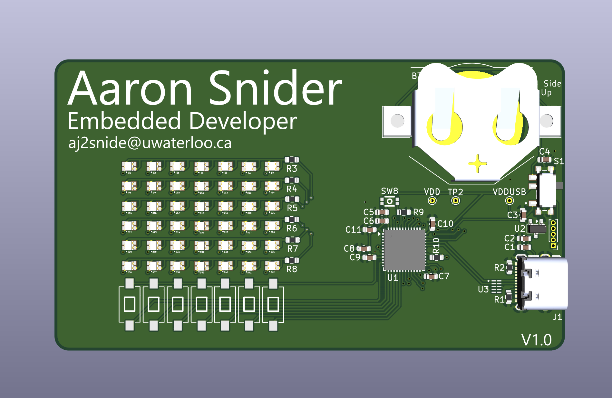

# Connect 4 Business Card

This business card doubles as a portable, handheld gaming device that allows a user to play game of Connect 4 against an onboard AI bot. Built on the STM32 platform, it features a custom 7x6 bicolor LED grid and a low-leakage power system designed for long-lasting battery operation.

> **Status:** Hardware V1.0 Release 
> **Hardware Version:** V1.0

---

## Features

- **Strategic Gameplay**
  - Play against a programmed AI bot on a microcontroller.
  - 7x6 bicolor LED grid representing the game board.

- **Dual Power Modes**
  - **Battery Mode:** Optimized for a CR2032 coin cell for maximum portability.
  - **High-Performance Mode:** USB-C power input automatically boosts clock frequency for faster AI move processing.

- **Intelligent Power Management**
  - Physical slide switch for hard battery disconnection to prevent leakage current.
  - Integrated under-voltage and brown-out protection (BOR/POR/PDR).
  - Battery voltage monitoring for low-power alerts.

- **Advanced Display Control**
  - 42 bicolor LEDs (84 total elements) routed antiparallel for layout efficiency.
  - Hardware-accelerated screen refreshing using DMA and Timers to minimize CPU overhead.

- **Optimized Inputs**
  - 7 dedicated column buttons for move selection.
  - Interrupt-driven debouncing to ensure clean, single-press registration.

---

## Bill of Materials (Summary)

| Item             | Part Number           | Qty | Notes                          |
|------------------|-----------------------|-----|--------------------------------|
| MCU              | STM32U073CCU6         | 1   | Ultra-low-power ARM Cortex-M0+ |
| Bicolor LEDs     | P4-1615ROTCA1-0.6T    | 42  | Red/Orange SMD LEDs            |
| Battery Holder   | Keystone 3002         | 1   | For CR2032 Coin Cell           |
| USB-C Connector  | SHOU HAN C2765186     | 1   | 16-pin Power/Data Delivery     |
| LDO Regulator    | MCP1700T-3002E/TT     | 1   | Low Quiescent Current 3.0V     |
| Input Buttons    | TSB008A2518A          | 7   | Ultra-thin NO buttons          |
| Power Switch     | MSK12C02-HB           | 1   | Battery/USB-C Selection        |

---

## Hardware Subsystems

### Power Supply

- **Primary:** CR2032 Coin Cell.
- **Secondary:** USB-C (5V) regulated through an MCP1700 LDO.
- **Switching:** A physical SPDT switch toggles between sources. The "ON" position selects the battery, while "OFF" selects USB-C, ensuring the battery is physically disconnected when using external power.
- **Monitoring:** The STM32 utilizes its internal POR/PDR/BOR peripherals to monitor voltage levels and provide under-voltage protection.

---

### Microcontroller (STM32U073CCU6)

- **Architecture:** Ultra-low-power high-performance MCU.
- **Clock Management:** - **Battery Mode:** Lower frequency to conserve energy.
  - **USB Mode:** Increased clock frequency for "intense" AI computation.

**Key Peripherals**

| Function         | Peripheral      | Notes                                  |
|------------------|-----------------|----------------------------------------|
| LED Matrix       | GPIO Port B     | Direct register writes for speed       |
| Refresh Timing   | Hardware Timer  | Triggers DMA transfers                 |
| Data Transfer    | DMA             | Automated GPIO updates                 |
| User Inputs      | EXTI (1-7)      | Pull-down resistors on Port A          |
| Firmware Update  | USB-C (DFU)     | Native USB 2.0 bootloader support      |
| Debug            | SWD             | Standard programming interface         |

---

### Display Implementation

The display consists of 42 bicolor LEDs wired in an antiparallel configuration.
- **Efficiency:** LEDs share pins to reduce the required GPIO count.
- **Refresh Logic:** A hardware timer triggers a DMA stream that performs direct register writes to GPIO Port B. This ensures a flicker-free display without taxing the main CPU core.

---

### Inputs & UI

- **Buttons:** 7 tactile switches corresponding to the 7 columns of the Connect 4 board.
- **Debouncing:** Handled via software flags within an Interrupt Service Routine (ISR). The system clears the flag just before the player turn for software input debouncing.

---

## Firmware Architecture

### Overview

The firmware is designed for efficiency and responsiveness. On startup, the MCU performs a **USB-C Detection** check. If USB power is detected, the clock registers are configured for high-speed operation. The main game loop handles the Connect 4 logic, while the display refresh is handled entirely in the background via DMA.

### Programming

- **DFU Mode:** The USB-C port allows for easy firmware updates using Device Firmware Upgrade (DFU) mode.
- **Debug:** A standard SWD header is provided for real-time debugging and initial flashing.